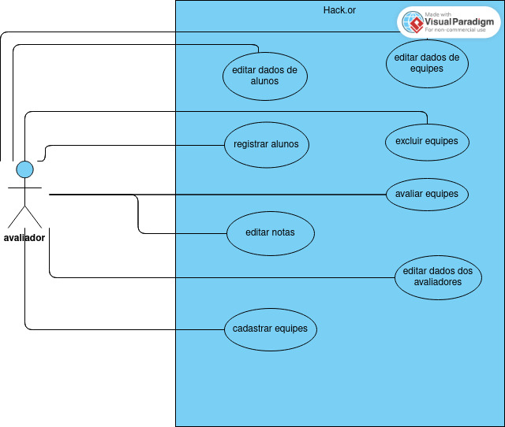

# Hackaton 2023 - Hack.or

Sistema para gerenciamento para maratonas de programação (Hackatons) dos terceiros anos do Curso Técnico em Informática para a Internet integrado ao Ensino Médio do IFC - Campus Araquari e outros Campi IFC.

Equipe:
- [Geovana Horodeski](github.com/horodeski)
- [Gustavo de Paula Gorges](github.com/GustavodePaulaGorges)
- [Maria Eduarda Nunes Gerotti](github.com/mariagerotti)
- [Victor Luiz da Silva](github.com/VictoorLDS)

  
Links do projeto:

-   [Documentação (esse documento)](github.com/Pro3-2/Documentacao)
-   Backend: [Repositório](https://github.com/Pro3-2/DjangoBla-main) e [Publicação](https://djangobla-main-dev-khme.2.us-1.fl0.io/api)
-   Frontend: [Repositório](https://github.com/Pro3-2/Hack-or) e [Publicação](https://hackor.surge.sh)
-   Apresentação: [link para a apresentação](https://docs.google.com/presentation/d/1yj3asOVc79Y7Qi3djOMDUuR7UgqGJyIQ9VKU2kBr9UI/edit?usp=sharing)

# Descrição da proposta

O projeto do Hackathon do Instituto Federal Catarinense - Campus Araquari tem como objetivo o ensino e incentivo dos alunos ao trabalho em equipe e auto-desenvolvimento por meio de sua metodologia ativa. Previamente pensado apenas para o 3º ano do ensino médio técnico e durante apenas um ano, foi observada a efetividade do projeto, sendo implementado para os próximos anos e todas as turmas do técnico em informática, portanto, se tem a necessidade do uso do Software para administrar, avaliar e manter a organização dos projetos para melhor desempenho no futuro dessa realização. O Software conterá a autenticação apenas de professores avaliadores, que pontuarão as equipes de acordo com categorias pré-dispostas com notas de 0 a 5 pontos. 

# Regras de negócio

  ****R.N. 01 -** Autenticação de Usuário:**
-  **Regra:**
            A autenticação do usuário será baseada em um sistema de login e senha.
 - **Restrição**:
            A senha deve conter pelo menos oito caracteres, incluindo letras maiúsculas, minúsculas, números e caracteres especiais.

 ****R.N. 02 -** Gerenciamento de Equipes:**
  -  **Regra:**
            Cada equipe deve ter um nome exclusivo no sistema.
  - **Restrição**:
            O número mínimo de membros em uma equipe é 1, e o número máximo é definido pelo administrador do sistema.

  ****R.N. 03 -** Gerenciamento de Participantes:**
  - **Regra:**
            Cada participante deve ser associado a uma equipe.
  - **Restrição**:
            Um participante só pode pertencer a uma equipe por vez.

  ****R.N. 04 -** Gerenciamento de Avaliadores:**
  -  **Regra:**
            Cada avaliador deve ter uma área de expertise claramente definida.
  - **Restrição**:
            Um avaliador não pode ser removido se estiver associado a avaliações em andamento.

  ****R.N. 05 -** Gerenciamento de Notas:**
  - **Regra:**
            Notas só podem ser atribuídas a participantes por avaliadores autorizados.
  - **Restrição**:
            As notas devem estar dentro de um intervalo específico, determinado pelo administrador do sistema.

  ****R.N. 06 -** Gerenciamento de Edições de Eventos:**
  - **Regra:**
            Cada edição de evento deve ter um nome único no sistema.
  - **Restrição**:
            Uma edição de evento não pode ser encerrada enquanto houver participantes com avaliações pendentes.

  **R.N. 07 - Usabilidade:**
  -  **Regra:**
            A interface do usuário deve ser projetada de forma a facilitar a navegação e compreensão das funcionalidades.
  - **Restrição**:
            As operações mais frequentes devem ser acessíveis em no máximo três cliques.

# Requisitos funcionais

**Entradas:**

- **R.F. 01 - Registro do Usuário:** O sistema deve permitir o registro de usuários.
  - **Dados necessários:** login, senha, nível de permissão. 
  - **Usuários:** avaliadores do sistema.

- **R.F. 02 - Registro de alunos:** O sistema deve permitir o registro de alunos por professores.
  - **Dados necessários:** login, senha, nível de permissão. 
  - **Usuários:** avaliadores do sistema.

- **R.F. 03 - Restrição de participação:** O sistema deve permitir que um aluno participe apenas de uma equipe.
  - **Dados necessários:** login, senha, nível de permissão. 
  - **Usuários:**  avaliadores do sistema.

- **R.F. 04 - Cadastro de Equipes:** O sistema deve permitir o cadastro das equipes participantes com os alunos registrados.
  - **Dados necessários:** id equipe, nome da equipe, tema, turma, edição participante.
  - **Usuários:** avaliadores do sistema.

- **R.F. 05 - Edição de informações das equipes:** O sistema deve permitir a edição das informações da equipe.
   - **Dados necessários:** id equipe, nome da equipe, tema, turma, edição participante.
   - **Usuários:** avaliadores do evento.

- **R.F. 06 - Edição de informações dos participantes:** O sistema deve permitir a edição dos dados dos participantes.
  - **Dados necessários:** id usuario, nome usuario, email.
  - **Usuários:** avaliadores do evento.

- **R.F. 07 - Edição de informações dos avaliadores:** O sistema deve permitir a edição dos dados dos avaliadores.
  - **Dados necessários:**  id usuario, nome usuario, email.
  - **Usuários:** avaliadores do evento.

- **R.F. 08 - Atribuição de notas às equipes:** O sistema deve permitir a atribuição de nota às equipes.
  - **Dados necessários:** formato que aceite notas de 0 à 5.
  - **Usuários:** avaliadores do evento.

- **R.F. 09 - Edição de notas atribuídas.** O sistema deve permitir a edição de nota às equipes.
  - **Dados necessários:** nota anterior dada, projeto esteja na competição.
  - **Usuários:** avaliadores do evento.

**Processamento:**

- **R.F. 11 - Verificação da validade do login e senha:** O sistema deve verificar a validade da autenticação dos usuários.
  - **Dados necessários:** login, senha.
  - **Usuários:**  avaliadores do sistema.

**Saídas:**

- **R.F. 14 - Relatórios Personalizáveis:** O sistema deve manter relatórios que podem incluir gráficos, tabelas e dados específicos do desempenho das equipes. 
  - **Dados necessários:** avaliações feitas.
  - **Usuários:** todos os níveis de usuário.

- **R.F. 15 - Pesquisa de Equipes:** O sistema deve permitir a busca por meio de pesquisa das equipes. 
  - **Dados necessários:** Nome da equipe ou edição participada.
  - **Usuários:** avaliadores do evento.
 
#  Requisitos não funcionais

  **Atributos de qualidade:**

**R.N.F. 01 - Segurança:** O sistema deve ser protegido contra acesso não autorizado.

**R.N.F. 02 - Níveis de segurança:** O software terá diferentes tipos de acesso para cada tipo de login, tendo as permissões ideais a função de cada um.

**R.N.F. 03 - Confiabilidade:** O sistema deve ser confiável e atender às necessidades do usuário.

**R.N.F. 04 - Facilidade de uso:** O sistema deve ser intuitivo e de fácil utilização pelos funcionários da loja, minimizando a necessidade de treinamento adicional.

**R.N.F. 05- Responsividade:**  O sistema deve ser responsivo, sendo possível sua utilização em diversos dispositivos com alteração mínima.

**R.N.F. 06 - Manutenção:** O sistema deve ser de fácil manutenção e atualização.

**R.N.F. 07 - Acessibilidade:** O sistema deve ser acessível à pessoas com deficiência visual, utilizando-se do alto contraste para superar e/ou melhorar a experiência do cliente.

**Restrições:** 

**R.N.F. 07 - Tecnologia Front-end web:** Para a exibição o sistema web será desenvolvido no framework VUEJS, HTML5 e CSS3.

**R.N.F. 08 - Tecnologia Back-end:** O software será desenvolvido em Python, utilizando o framework Django, com a API REST utilizando o Django REST Framework.

**R.N.F. 09 - Legais:** O sistema deve atender às exigências da LGPD (Leis Gerais da Proteção de Dados).

**R.N.F. 10- Disponibilidade:** O sistema deve atualizar em tempo real as informações das equipes e seus dados durante o evento vigente.

**R.N.F. 11 - Acesso restrito:** O sistema deve permitir a configuração de perfis de acesso restrito para os avaliadores, garantindo que apenas pessoas autorizadas possam realizar alterações nos dados fornecidos.

# Diagrama de Caso de Uso - UML

---
