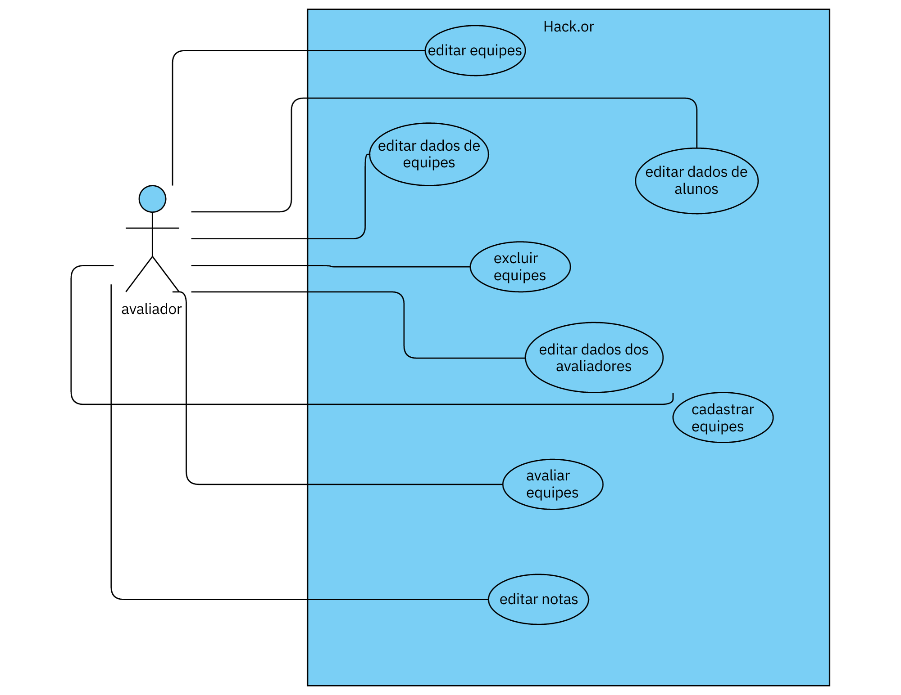

# Hackaton 2023 
*(Coloque aqui o nome do seu projeto.)*

Sistema para gerenciamento das maratonas de programação (Hackatons) dos terceiros anos do Curso Técnico em Informática para a Internet integrado ao Ensino Médio do IFC - Campus Araquari.

Equipe:
- [Geovana Horodeski](github.com/horodeski)
- [Gustavo de Paula Gorges](github.com/GustavodePaulaGorges)
- [Maria Eduarda Nunes Gerotti](github.com/mariagerotti)
- [Victor Luiz da Silva](github.com/VictoorLDS)

  
Links do projeto:

-   [Documentação (esse documento)](github.com/Pro3-2/Documentacao)
-   Backend: [Repositório](github.com/marcoandre/pi-backend) e [Publicação](https://pi-backend.herokuapp.com/)
-   Frontend: [Repositório](github.com/marcoandre/pi-frontend) e [Publicação](https://pi-frontend.herokuapp.com/)

# 1. Descrição da proposta

O projeto do Hackathon do Instituto Federal Catarinense - Campus Aaraquari tem como objetivo o ensino e incentivo dos alunos ao trabalho em equipe e auto-desenvolvimento por meio de sua metodologia ativa. Previamente pensado apenas para o 3º ano do ensino médio técnico e durante apenas um ano, foi observada a efetividade do projeto, sendo implementado para os próximos anos e todas as turmas do técnico em informática, portanto, se vê a necessidade do uso do Software para administrar, avaliar e manter a organização dos projetos 

**Alguns pontos importantes a se destacar são:**
-   **Qual o foco de ação do software** relacionado com os problemas levantados na análise da situação-problema. O que realmente o software vai fazer. Por exemplo, o foco de ação do Gmail é permitir o envio e recebimento de e-mails.
-   **Os níveis de usuário do sistema**. Somente o gestor tem acesso? E os funcionários? Talvez seja para ambos, ou para funcionários de cargos
    diferentes, etc.
-   **O que poderá ser feito no software**.Apenas o principal, sem pensar em telas ou detalhes específicos, pois isso será feito em outro momento.
-   **Se houver mais de um nível de usuário**, ressaltar as diferenças entre eles na descrição da proposta.

# 2. Regras de negócio

  **R.N. 01 - Autenticação de Usuário:**

  Regra:
            A autenticação do usuário será baseada em um sistema de login e senha.
  Restrição:
            A senha deve conter pelo menos oito caracteres, incluindo letras maiúsculas, minúsculas, números e caracteres especiais.

 **R.N. 02 - Gerenciamento de Equipes:**
        Regra:
            Cada equipe deve ter um nome exclusivo no sistema.
        Restrição:
            O número mínimo de membros em uma equipe é 1, e o número máximo é definido pelo administrador do sistema.

  **R.N. 03 - Gerenciamento de Participantes:**
        Regra:
            Cada participante deve ser associado a uma equipe.
        Restrição:
            Um participante só pode pertencer a uma equipe por vez.

  **R.N. 04 - Gerenciamento de Avaliadores:**
        Regra:
            Cada avaliador deve ter uma área de expertise claramente definida.
        Restrição:
            Um avaliador não pode ser removido se estiver associado a avaliações em andamento.

  * *R.N. 05 - Gerenciamento de Notas:**
        Regra:
            Notas só podem ser atribuídas a participantes por avaliadores autorizados.
        Restrição:
            As notas devem estar dentro de um intervalo específico, determinado pelo administrador do sistema.

  **R.N. 06 - Gerenciamento de Edições de Eventos:**
        Regra:
            Cada edição de evento deve ter um nome único no sistema.
        Restrição:
            Uma edição de evento não pode ser encerrada enquanto houver participantes com avaliações pendentes.

  **R.N. 07 - Usabilidade:**
        Regra:
            A interface do usuário deve ser projetada de forma a facilitar a navegação e compreensão das funcionalidades.
        Restrição:
            As operações mais frequentes devem ser acessíveis em no máximo três cliques.

# 5. Requisitos funcionais

**Entradas:**

- **R.F. 01 - Registro do Usuário:** O sistema deve permitir o registro de usuários.
 - **Dados necessários:** login, senha, nível de permissão. 
  - **Usuários:** todos os níveis de usuário.

- **R.F. 02 - Cadastro de Equipes:** O sistema deve permitir o cadastro das equipes participantes com os alunos registrados.
  - **Dados necessários:** dado 1, dado 2, dado 3.
  - **Usuários:** Alunos participantes do evento

- **R.F. 02 - Edição de informações das equipes:** O sistema deve permitir a edição das informações da equipe.
  - **Dados necessários:** dado 1, dado 2, dado 3.
  - **Usuários:** Avaliadores do evento.

- **R.F. 02 - Exclusão de equipes:** O sistema deve permitir a exclusao das equipes.
  - **Dados necessários:** dado 1, dado 2, dado 3.
  - **Usuários:** Avaliadores do evento.

- **R.F. 02 - Edição de informações dos participantes:** O sistema deve permitir a edição dos dados dos participantes.
  - **Dados necessários:** dado 1, dado 2, dado 3.
  - **Usuários:** Avaliadores do evento.

- **R.F. 02 - Edição de informações dos avaliadores:** O sistema deve permitir a edição dos dados dos avaliadores.
  - **Dados necessários:** dado 1, dado 2, dado 3.
  - **Usuários:** Avaliadores do evento.

- **R.F. 02 - Atribuição de notas aos participantes.:** O sistema deve permitir a atribuição de nota às equipes.
  - **Dados necessários:** dado 1, dado 2, dado 3.
  - **Usuários:** Avaliadores do evento.

- **R.F. 02 - Edição de notas atribuídas.** O sistema deve permitir a edição de nota às equipes.
  - **Dados necessários:** dado 1, dado 2, dado 3.
  - **Usuários:** Avaliadores do evento.

- **R.F. 02 - Remoção de notas atribuídas:** O sistema deve permitir exclusão de nota às equipes.
  - **Dados necessários:** dado 1, dado 2, dado 3.
  - **Usuários:** Avaliadores do evento.
**Processamento:**

- **R.F. 03 - Verificação da validade do login e senha:** O sistema deve verificar a validade da autenticação dos usuários.
  - **Dados necessários:** login, senha.
  - **Usuários:** todos os níveis de usuário.

- **R.F. 04 - Validação do nível de permissão do usuário:** O sistema deve validar o nível de permissão do usuário para acessar os dados da aplicação0.
  - **Dados necessários:** dado 1, dado 2, dado 3.
  - **Usuários:** todos os níveis de usuário.

- **R.F. 04 - Validação do nível de permissão do usuário:** O sistema deve validar o nível de permissão do usuário para acessar os dados da aplicação0.
  - **Dados necessários:** dado 1, dado 2, dado 3.
  - **Usuários:** todos os níveis de usuário.

**Processamento:**

**Saídas:**

- **R.F. 05 - Relatórios Personalizáveis:** O sistema deve manter relatórios que podem incluir gráficos, tabelas e dados específicos do usuário.. 
  - **Dados necessários:** dado 1, dado 2, dado 3.
  - **Usuários:** todos os níveis de usuário.

- **R.F. 06 - Pesquisa de Equipes:** O sistema deve permitir a busca por meio de pesquisa das equipes. 
  - **Dados necessários:** Nome da equipe ou edição participada.
  - **Usuários:** Usuário tipo Admin.

# 6. Requisitos não funcionais

Os requisitos não funcionais podem ser divididos em duas categorias:

1. **Atributos de qualidade:** Estas são as características do sistema que determinam sua qualidade geral. Exemplos de atributos de qualidade incluem segurança, desempenho e usabilidade.

R.N.F. 04 - Segurança: O sistema deve ser protegido contra acesso não autorizado.

R.N.F. 05 - Níveis de segurança: O software terá diferentes tipos de acesso para cada tipo de login, tendo as permissões ideais a função de cada um.

R.N.F. 14 - Facilidade de uso: O sistema deve ser intuitivo e de fácil utilização pelos funcionários da loja, minimizando a necessidade de treinamento adicional.

R.N.F. 02 - Responsividade/Usabilidade: O sistema deve ser responsivo, sendo possível sua utilização em diversos dispositivos com alteração mínima.

1. **Restrições:** Estas são as limitações impostas ao sistema.
Exemplos de restrições incluem tempo, recursos e ambiente.

R.N.F. 01 - Atuação: O sistema deve ser capaz de lidar com o número necessário de usuários sem queda brusca de desempenho.

R.N.F. 03 - Manutenção: O sistema deve ser de fácil manutenção e atualização.

R.N.F. 06 - Tecnologia Front-end web: Para a exibição o sistema web será desenvolvido no framework VUEJS, HTML5 e CSS3.

R.N.F. 07 - Tecnologia Front-end mobile: Para a exibição, o sistema mobile será desenvolvido no framework React-Native.

R.N.F. 08- Tecnologia Back-end: O software será desenvolvido em Python, utilizando o framework Django, com a API REST utilizando o Django REST Framework.

R.N.F. 10 - Confiabilidade: O sistema deve ser confiável e atender às necessidades do usuário.

R.N.F. 11 - Legais: O sistema deve atender às exigências da LGPD (Leis Gerais da Proteção de Dados).

R.N.F. 12 - Disponibilidade: O sistema deve atualizar em tempo real as informações do estoque, permitindo aos três níveis usuários visualizar a disponibilidade de produtos.

R.N.F. 13 - Acesso restrito: O sistema deve permitir a configuração de perfis de acesso restrito para os funcionários, garantindo que apenas pessoas autorizadas possam realizar alterações no estoque e no caixa.

# 7. Diagrama de Caso de Uso

---
